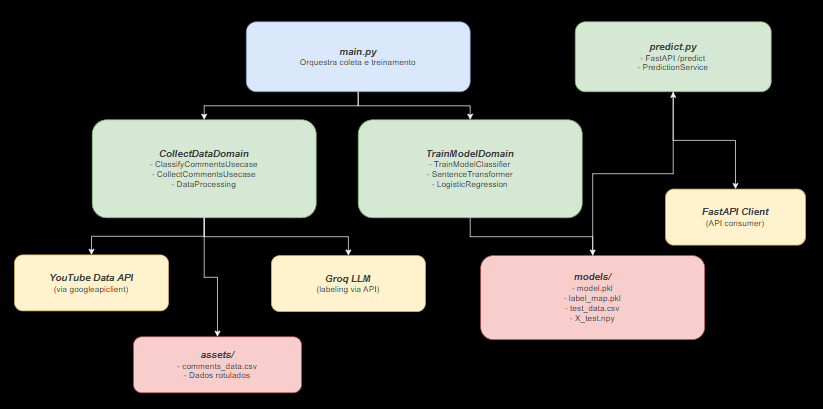
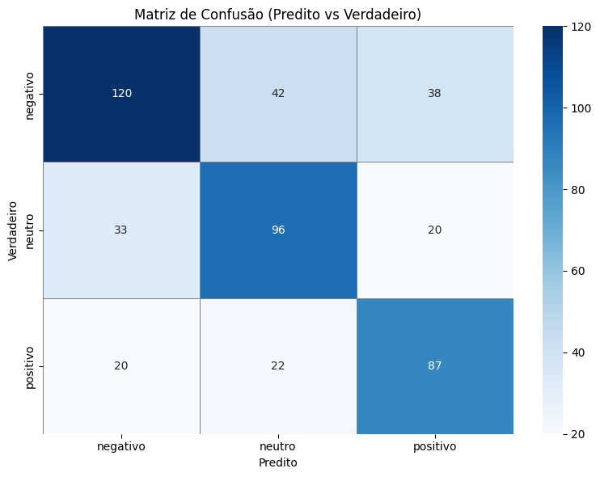

# NLP Comment Classification Pipeline

## Overview

Sistema de Machine Learning end-to-end para análise de sentimentos em comentários, com pipeline completo de dados, treinamento de modelo, deploy e serving em produção.

✔ API pública em produção na AWS EC2  
✔ Modelo NLP baseado em embeddings (Transformers)  
✔ Arquitetura modular e escalável  
✔ Pipeline completo (data → training → inference)  
✔ Orquestração de infraestrutura com agendamento via EventBridge Scheduler  
✔ Otimização de custos com políticas automatizadas de start/stop da instância (execução apenas em dias úteis, 08:00–21:00)  
✔ Separação clara entre camadas de dados, lógica de negócio e serving (boas práticas de MLOps)  

## Live API

Endpoint público:

[Swagger UI](http://35.153.194.48:8000/docs)

### Acesso Rápido

- Predict endpoint: `/predict`  
- Method: `POST`

## Teste rápido da API

```bash
curl -X POST "http://35.153.194.48:8000/predict" \
-H "Content-Type: application/json" \
-d '{"text": "isso é muito bom"}'
```

Resposta:

```json
{
  "prediction": "positivo"
}
```

## Problema

Classificação de comentários em três categorias:

- Positivo
- Neutro
- Negativo

### Principais desafios

- Desbalanceamento de classes
- Ruído na rotulação gerada por LLM
- Limitações de representações baseadas em TF-IDF

---

## Solução

Pipeline completo de Machine Learning desenvolvido com foco em engenharia, priorizando:

- Modularidade e separação de responsabilidades
- Reprodutibilidade de experimentos
- Escalabilidade do pipeline
- Estrutura preparada para produção

### Evolução da abordagem

#### Baseline (TF-IDF + modelos tradicionais)

| Modelo | Accuracy | Macro F1 |
|--------|----------|----------|
| MLPClassifier | 0.68 | 0.50 |
| Logistic Regression | 0.64 | 0.53 |
| LinearSVC | 0.69 | 0.50 |

**Observações:**

- Boa accuracy, mas baixa generalização
- Forte sensibilidade ao desbalanceamento
- Limitação semântica do TF-IDF

#### Versão final (Embeddings + Logistic Regression)

Substituição do pipeline de features:

- TF-IDF → embeddings com Transformers
- Representação sintática → representação semântica contextual

### Melhorias implementadas

**Dados**
- Subamostragem da classe majoritária
- Adição de dados sintéticos (+200 positivos e +200 neutros)
- Melhor balanceamento do dataset

**Modelagem**
- Migração de TF-IDF para embeddings com Transformers
- Melhor captura de contexto semântico
- Redução de overfitting em padrões superficiais

**Pipeline**
- Separação clara entre etapas de processamento
- Componentização dos módulos
- Arquitetura preparada para substituição de componentes

---

## Arquitetura



### Pipeline end-to-end

```text
Data Collection → Processing → LLM Labeling → Training → Inference API
```

### Fluxo de execução

```
main.py
→ coleta de dados
→ processamento
→ rotulação com LLM
→ treino do modelo
→ salvamento de assets e modelos
→ API de inferência (predict.py)
```

### Estrutura em camadas

**Domain Layer**
- Orquestração do fluxo de ML
- Regras de negócio do pipeline
- Coordenação entre etapas

**Use Cases Layer**
- Coleta de dados (YouTube API)
- Rotulação com LLM
- Treinamento do modelo

**Data Layer**
- Limpeza e normalização
- Preparação dos dados

**Inference Layer (FastAPI)**
- Serviço de predição em tempo real
- Carregamento do modelo treinado
- Endpoint de inferência

### Tecnologias utilizadas

- Python
- Scikit-learn
- Transformers (embeddings)
- FastAPI
- Pandas / NumPy
- YouTube API
- LLM para rotulação
- Docker
- AWS EC2

---

## Resultados

| Modelo | Accuracy | Macro F1 |
|--------|----------|----------|
| Transformer Embeddings + Logistic Regression | 0.65 | 0.64 |



### Análise do Modelo
- Bom desempenho em sentimentos explícitos
- Comentários claramente positivos ou negativos são bem classificados.
- Dificuldade com classe neutra
- Maior parte dos erros ocorre entre:
    neutro → positivo
    neutro → negativo
- Ambiguidade e contexto
  Comentários com múltiplos sentimentos ou contexto implícito geram erros.
- Textos curtos / pouco informativos
    Frases com baixa densidade semântica reduzem a qualidade dos embeddings.

### Conclusão
O modelo captura bem polaridade básica, mas tem limitações em:
  * nuance semântica
  * ambiguidade
  * neutralidade

### Desempenho por classe

| Classe | Precision | Recall | F1-score |
|--------|-----------|--------|----------|
| Negativo | 0.69 | 0.66 | 0.67 |
| Positivo | 0.65 | 0.67 | 0.66 |
| Neutro | 0.59 | 0.62 | 0.61 |

A evolução de TF-IDF para embeddings contextuais resultou em melhor generalização do modelo e maior equilíbrio entre classes, com Macro F1 passando de 0.50–0.53 para 0.64.

---

## Deploy

### Containerização (Docker)

```bash
docker build -t nlp-comment-classifier .
docker run -p 8000:8000 nlp-comment-classifier
```

**Benefícios:**

- Ambiente padronizado entre desenvolvimento e produção
- Facilidade de deploy
- Isolamento de dependências

### AWS EC2

```text
Docker Image → AWS EC2 Instance → FastAPI Service → Inference Endpoint
```

**Características:**

- Execução em ambiente Linux (Ubuntu)
- Serviço FastAPI exposto via porta pública
- Uso de container Docker para consistência entre ambientes
- Inferência acessível remotamente via API

### Execução local

**Treinamento:**

```bash
python src/main.py
```

**Inferência:**

```bash
uvicorn src.predict:app --reload
```
--- 
## Melhorias Futuras

* Fine-tuning de modelos Transformers para melhor captura de contexto
* Melhoria da qualidade e balanceamento dos dados (especialmente classe neutra)
* Análise mais profunda de erros para identificar padrões
* Versionamento e monitoramento do modelo em produção
* Exposição de métricas de confiança na API